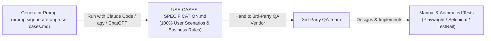

# nRouter App — QA Use Case Specifications & Scenarios

This directory (`tests/scenarios/nrouter-app/`) holds the **Use Case Specification Documents** and **QA Scenarios** for `nrouter-app` (the customer dashboard and control plane at `https://app.nrouter.ai`).

---

## Workflow: From Use Cases to Test Cases



---

## Step 1: Generate the Use Case Specification Document

The prompt to generate the comprehensive, 100% full-coverage Use Case Specification is:
- **[`prompts/generate-app-use-cases.md`](prompts/generate-app-use-cases.md)**

### How to Run:
You can run this prompt using **Claude Code**, **Antigravity (`agy`)**, or **ChatGPT**:

```bash
# Option A: Non-interactive CLI with Claude Code
claude -p "$(cat nrouter-sdk/tests/scenarios/nrouter-app/prompts/generate-app-use-cases.md)"

# Option B: In Antigravity / Claude Code interactive session
# Simply prompt:
# "Execute nrouter-sdk/tests/scenarios/nrouter-app/prompts/generate-app-use-cases.md to generate the complete USE-CASES-SPECIFICATION.md file."

# Option C: Copy & Paste into ChatGPT (GPT-4o / o3-mini) or Claude 3.5 Sonnet
# Paste the prompt contents from prompts/generate-app-use-cases.md.
```

### What It Produces:
- **`USE-CASES-SPECIFICATION.md`**: Contains 75–100+ complete Cockburn-style Use Cases covering all 102 routes and 16 functional modules of `nrouter-app`.
- Focuses purely on: Primary Actors, Preconditions, Triggers, Happy Paths, Alternative Flows & Edge Cases, Business Invariants, and Post-conditions.
- Contains **no test code or fragile UI selectors**, making it the clean, authoritative business contract for the 3rd-party QA vendor.

---

## Step 2: (Optional / Downstream) Automated Test Case Generation

If your team or the 3rd-party vendor also wants automated Playwright / Selenium test templates, you can subsequently run:
- **[`prompts/generate-app-test-cases.md`](prompts/generate-app-test-cases.md)**
